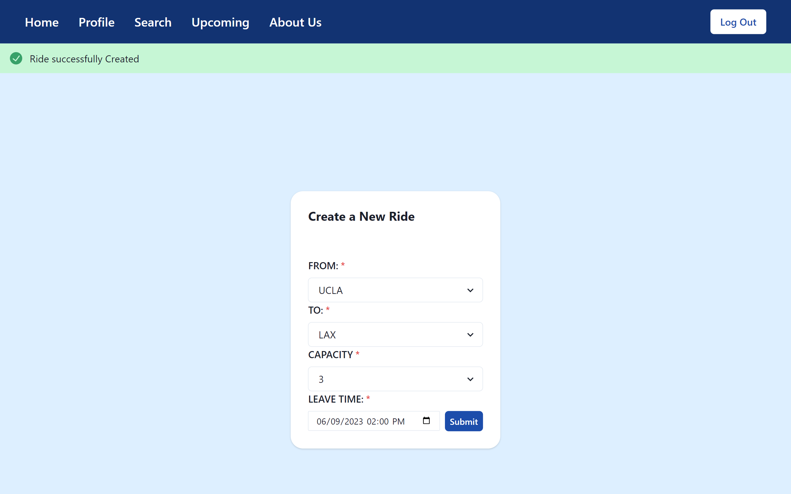

# Bruber

CS35L Project


## Inspiration:
After observing numerous UCLA students seeking ride sharing options on Snapchat, we decided to build a transportation web app service for students to conveniently ride share - Bruber.

## Interact:
You can checkout and interact with the project here: [Bruber](https://bruber-git-main-shzcuber.vercel.app/)

## Run Locally:
To Run this project Locally:

```
git clone https://github.com/shzcuber/bruber
```

```
cd backend
```

```
npm i
```

```
node app.js
```

then, to start the frontend

```
cd frontend
```

```
npm i
```

```
npm start
```

Optional:
You can also activate the Landing page by:

```
cd landing
```

```
npm i
```

```
npm start
```

## How it works
- First you need to Signup/Login:

- Search Rides using the home page

- Which redirects you to the rides page, where you can see rides details and sign up for it

- Creates ride using create ride option



## Technology Stack and Acknowledgements
We used:
- React.js as frontend library
- Node.js and Express.js for backend
- ChakraUI for modelling UI elements
- CharkarUI Library for components
- Firebase as database
- Firebase Auth as authentication service

# Creators
- Kevin Xia
- Shawn Zhuang
- Viraj Chhajed
- Peter Ngyuen
- Jimmy Fang

## to do:
- Add ratings images
- describe the app better
- It says "5% – Detailed README file that accurately and completely describes how to run the app locally.", so need to add more details
- add hyperlinks


