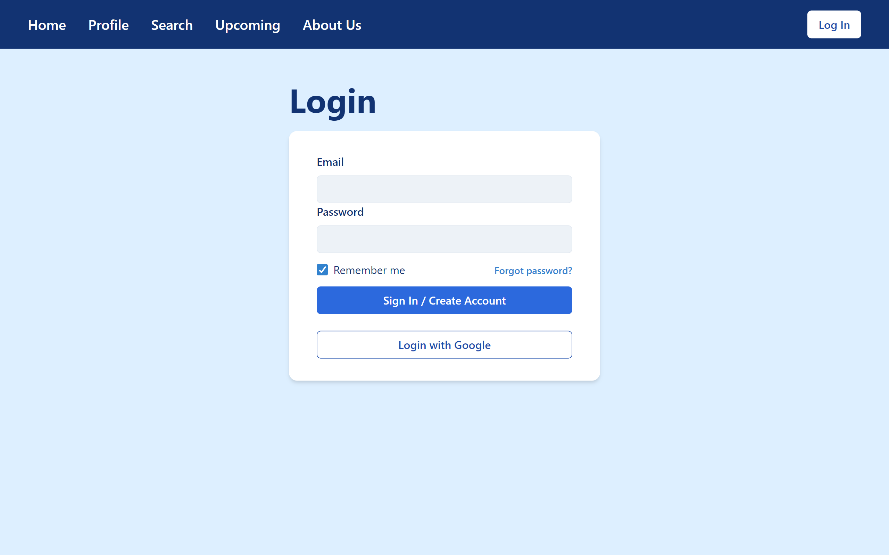

# Bruber

CS35L Project


## What is Bruber?
Bruber is a ridesharing coordination app designed specifically for UCLA students (Go Bruins!). It aims to provide a convenient platform for Bruins to coordinate and share rides to and from campus or other locations such as LAX or other campuses.

## Inspiration:
After observing numerous UCLA students seeking ride sharing options on Snapchat, we decided to build a transportation web app service for students to conveniently ride share - Bruber.

## Features
Easy ride coordination: Bruber allows users to easily coordinate and schedule rides with fellow Bruins.
Flexible scheduling: Bruins can schedule rides in advance or find immediate rides based on their preferences and availability.

## How to Use Bruber?
- Go to the Bruber website
- Create an account with an email/password combination or your Google account.
- Set up your profile with your name and phone number.
- Explore available rides or create a new ride listing as a driver.
- When you find a suitable ride or a passenger, coordinate the details with your fellow Bruberers through the given contact information.
- Complete the ride and leave feedback for your fellow Bruins to help maintain a reliable community.

## Interact:
Live/hosted version of our website: https://bruber.vercel.app/

## Run Locally:
To Run this project Locally:

***IMPORTANT***: *We have environment variables that you will have to replace to be able use properly. Please be mindful of that!*

We recommend interacting with the App, using the deployed links, but if you want to test locally please create .env files in both frontend and backend folders and update according to your preference.


```
$ git clone https://github.com/shzcuber/bruber
```
To start the backend:
```
$ cd backend
$ npm i
$ node app.js
```

then, to start the frontend

```
$ cd frontend
$ npm i
$ npm start
```

Optional:
You can also activate the Landing page with the following:

```
$ cd landing
$ npm i
$ npm start
```

## How it works
- First you need to Signup/Login:

- Search Rides using the home page

- This redirects you to the rides page, where you can see rides details and sign up for it

- Creates ride using create ride option


## Technology Stack and Acknowledgements
We used:
- [React.js](https://react.dev/) as frontend library
- [Node.js](https://nodejs.org/en) and [Express.js](https://expressjs.com/) for backend
- [ChakraUI](https://chakra-ui.com/) for styling UI elements and for components
- [Firebase Firestore](https://firebase.google.com/) as database
- [Firebase Auth](https://firebase.google.com/) as authentication service
- [Vercel](https://vercel.com/) for frontend hosting 
- [Railway](https://railway.app/) for backend hosting

# Creators
- Kevin Xia
- Shawn Zhuang
- Viraj Chhajed
- Peter Ngyuen
- Jimmy Fang


